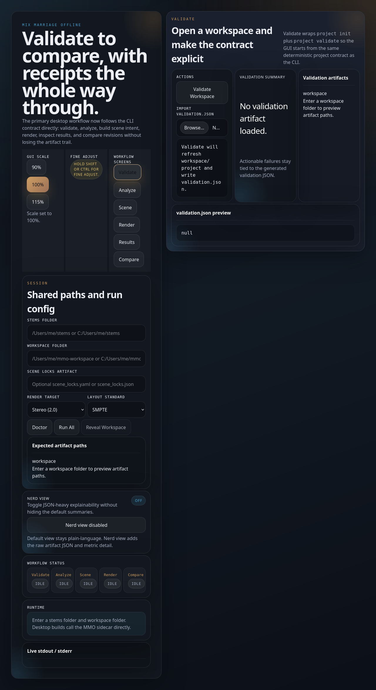
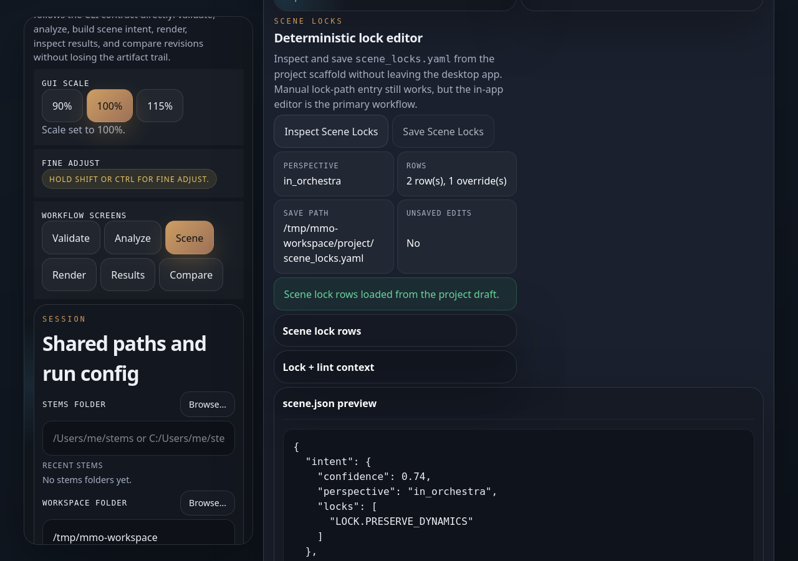
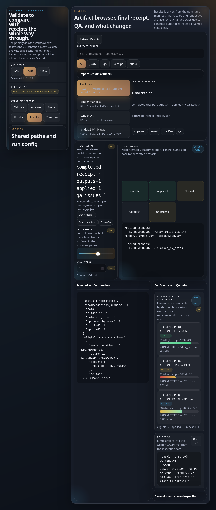
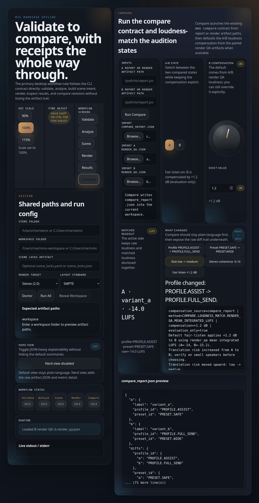

# Desktop GUI walkthrough

The GUI exists to reduce friction, not to hide the truth. It wraps the same CLI
behaviors, keeps receipts, and writes the same artifacts the CLI writes. Every
action is explainable, every output is traceable.

The primary GUI is the **Tauri desktop app**. It covers the full artifact-backed
workflow sequence: `Validate → Analyze → Scene → Render → Results → Compare`.

---

## How to read this chapter

The screenshots in this chapter are **canonical captured states**. Each one
shows a stable, reviewable moment in the app, not the only valid layout for
that screen.

The desktop app can change shape depending on what is loaded and what you have
opened. Expect differences between empty and loaded workspace mode, hero and
compact sidebar presentation, and collapsed versus expanded secondary panels.

Native OS dialogs such as folder pickers, file pickers, and recent-path menus
are intentionally described in text rather than shown as canonical screenshots.
They vary by platform and are not part of the stable app baseline.

---

## Launch

Run the Tauri desktop app from the repo or your installed package:

```
cd gui/desktop-tauri
npm run tauri dev        # development
npm run tauri build      # production build
```

Or launch the installed binary directly if you used a packaged install.

---

## Shared session shell

Before running any stage, configure the shared session shell:

- **Stems dir** — folder containing your exported stem files.
- **Workspace dir** — output folder where all artifacts will be written.
- **Layout standard** — the channel layout standard for your delivery (e.g.
  SMPTE, FILM, VST3). Internally normalized to SMPTE.
- **Render target** — the delivery target (e.g. stereo, 5.1, 7.1.4).

Use the native **Browse...** buttons for stems, workspace, compare inputs, and
optional scene-lock artifacts when running the packaged desktop app. Exact path
entry still works. The recent-workspace and recent-path menus may appear as
hero chips in the empty state or as compact controls once a workspace is
loaded, but they reuse the same deterministic history and set the same session
values either way.

These fields persist across screen switches. Set them once, then move through
Validate, Analyze, Scene, Render, Results, and Compare without re-entering
paths unless you want to change context.

The **scale control** (top-right, three buttons: 90 / 100 / 115) adjusts the
interface scale. Use 115 on a high-DPI or large display. Hold a modifier key
while adjusting a knob or slider to see the fine-adjust indicator.

---

**Canonical state: Session shell, loaded compact workspace mode**

Once a workspace or artifact is loaded, the onboarding hero collapses into a
more compact left rail so the active workflow screens get more horizontal room.
On narrower windows, some secondary controls may move lower on the page or live
inside collapsible sections, but the workflow and stored paths do not change.

---

## Canonical workflow states

### Validate

**Canonical state: Validate screen, session-ready empty state**

Use Validate to confirm the session is pointed at the right stems and workspace
before you commit to later stages.

1. Confirm your stems dir and workspace dir are set.
2. Click **Run Validate**.
3. Review the written artifact paths, validation summary, and report preview.

If you already have a loaded workspace, Validate still works the same way, but
the session shell usually appears in the compact loaded-workspace form instead
of the full hero presentation shown here.



Validation failures surface here with actionable messages. Fix them before
moving to Analyze.

---

### Analyze

Analyze is usually the first step where the app is clearly in loaded-workspace
mode.

1. Click **Run Analyze**.
2. Review the analysis summary, scan log, and report preview.

The layout may be more compact than the Validate empty state, but the important
workflow stays the same: run analysis, inspect the written artifacts, and keep
moving forward with the same session shell values.

---

### Scene

**Canonical state: Scene screen, loaded with lock context**

1. Click **Build Scene**.
2. Review the scene summary, focus controls, object routing context, current
   scene-lock context, lint warnings, and scene preview.

This is the canonical loaded state for understanding what MMO inferred before
you render.



**Canonical state: Scene screen, lock editor open**

When you open the lock editor, the same Scene screen shifts into an editing
state. Editable lock rows and save controls may appear inline or in a secondary
panel depending on window width and sidebar state. Use this state to review or
override perspective, role, front-only, surround, and height behavior, then
save `scene_locks.yaml` and rerun as needed.

If you are loading an existing locks file, use the **Browse...** button, a
recent-path entry, or exact path input. The native OS picker itself is
intentionally not shown here because it is not a canonical app state.

Saving scene locks refreshes the lock context and warnings so you can confirm
what changed before moving on to Render.

---

### Render

Render is log-driven rather than screenshot-driven.

1. Review the config summary (target, layout, stems dir, workspace).
2. Click **Run Render**.
3. Watch the live progress log as the render runs.
4. Click **Cancel** at any time to stop the render gracefully.

On smaller windows, the log and status sections may stack vertically or move
below summary controls. The workflow stays the same: confirm settings, render,
then move to Results.

---

### Results

**Canonical state: Results screen, loaded default state**

After a render completes, click **Refresh** (or navigate to Results). The
default loaded state leads with the artifact browser, selected artifact
preview, final receipt, and what changed.

Use this state when you want a quick answer to: what was written, what changed,
and which artifact should I inspect next?



**Canonical state: Results screen, secondary inspection expanded**

Deeper QA, confidence, and inspection views live in secondary sections. Those
sections can be collapsed, expanded, or pushed lower on the page as the window
and sidebar change. Use section headings and labels, not exact vertical
position, as your guide when you are inspecting QA issues, confidence rows, or
artifact-backed meters.

Import buttons and recent-path entry points for receipt or QA artifacts may move
between the main summary area and lower inspection sections, but they still
load the same underlying files.

---

### Compare

**Canonical state: Compare screen, loaded loudness-matched state**

1. Load **A** and **B** artifacts using exact paths, recent compare-input
   entries, or the **Browse...** buttons that open the native JSON/folder
   picker.
2. Use the **A / B toggle** to switch the active audition state.
3. Use the **compensation knob** (−12 to +12 dB, step 0.1) in the lower
   inspection section to loudness-match the two sides for a fair listen.
4. Review the compare summary, delta chips, loudness-match disclosure, and any
   lower inspection details you want to expand.

The default loaded state emphasizes the summary first. Compensation fine-tune
and raw compare-report inspection live in lower sections that may expand,
collapse, or move lower in the layout depending on available space.



The native picker dialog is intentionally not part of the canonical screenshot
baseline. Use the screenshot for orientation and the text for the full compare
workflow.

---

## Recommended workflow order

```
Validate → Analyze → Scene → Render → Results → Compare
```

Each stage depends on artifacts from the prior stage. Running out of order is
allowed but may produce missing-artifact warnings.

---

## Regenerating screenshots

The User Manual screenshots for this chapter are generated by the Tauri
Playwright capture spec. To regenerate them locally:

```
python tools/capture_tauri_screenshots.py --out-dir docs/manual/assets/screenshots
```

This starts the dev server automatically and captures four canonical states with
realistic fixture data:

- `tauri_session_ready.png` — Validate screen, session-ready empty state
- `tauri_scene_loaded.png` — Scene screen, loaded with lock context
- `tauri_results_loaded.png` — Results screen, loaded default state
- `tauri_compare_loaded.png` — Compare screen, loaded loudness-matched state

Other meaningful GUI states in this chapter, such as the loaded compact session
shell, the Scene lock editor open state, and Results secondary inspection
expanded, are described in text because they are more dependent on viewport and
panel state than on a single stable screenshot.

After running, commit the updated PNGs. The perceptual diff checker
(`tools/check_screenshot_diff.py`) validates that regenerated screenshots match
the committed baselines within tolerance.

---

## Legacy fallback (deprecated)

The CustomTkinter `mmo-gui` fallback (`python -m mmo.gui.main`) remains
available as a legacy bounded workflow but is **deprecated**. It will not
receive new parity work. For a zero-ambiguity workflow, use the Tauri app or
the CLI directly.

The legacy walkthrough content (screenshots, CTK-specific flow) has been
retired from this chapter. The parity checklist is tracked in
[../gui_parity.md](../gui_parity.md).
