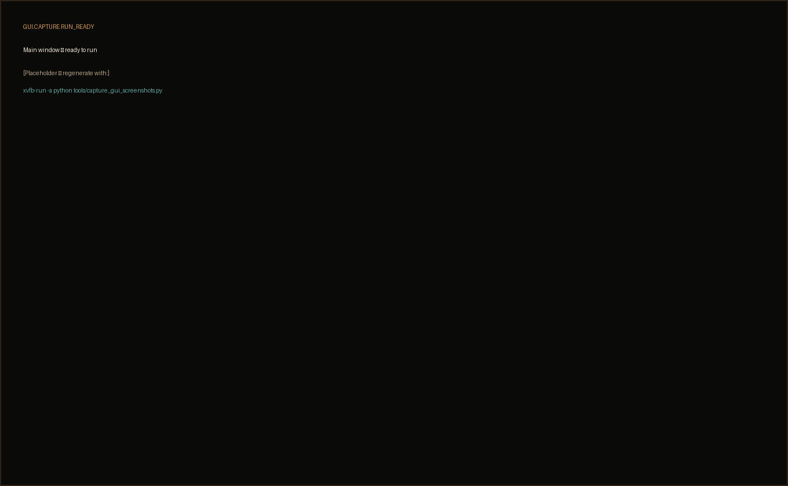
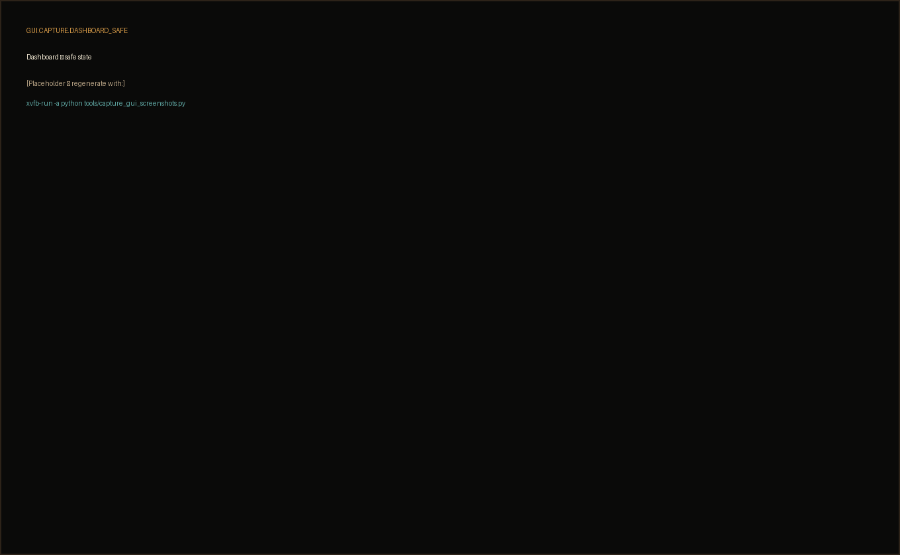
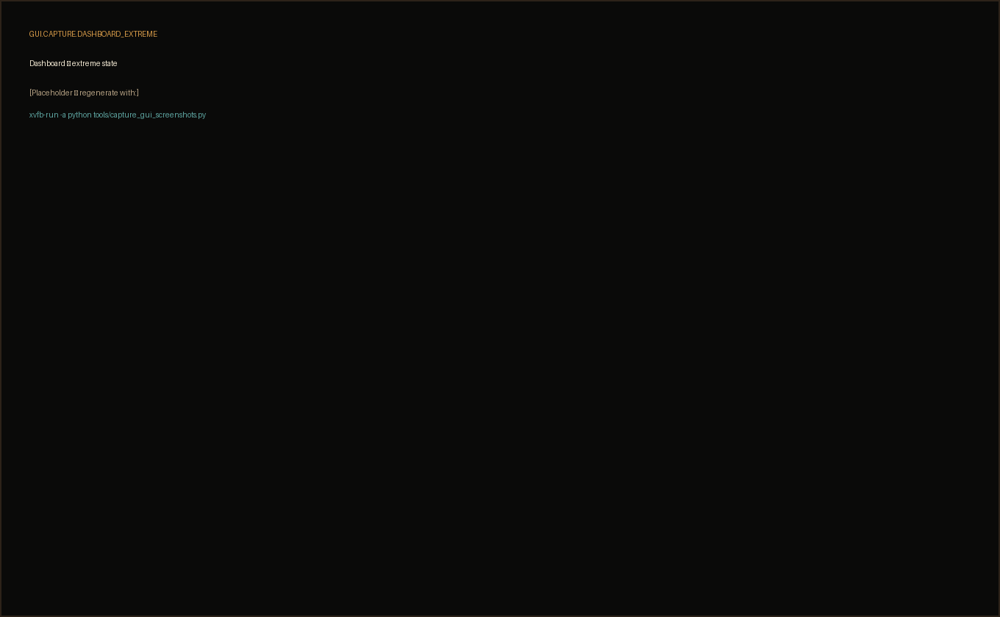

# Desktop GUI walkthrough (v1.1)

The GUI exists to reduce friction, not to hide the truth.
It wraps the same CLI behaviors and keeps receipts.

Launch the GUI.
mmo-gui
(Or run: python -m mmo.gui.main)

What the GUI is good for today.
Point-and-click stem selection.
Render target selection, including render-many defaults.
Layout standard selection.
Headphone preview toggle.
Offline plugin marketplace browsing and installation.
Deterministic visualization dashboard surfaces (spectrum, vectorscope, correlation risk, layout projection, intent cards).

Recommended GUI flow.
1) Choose your stems folder.
2) Choose your output folder.
3) Pick your target, or enable render-many.
4) Choose the layout standard you need for delivery.
5) Run the pipeline.
6) Review issues and receipts.
7) Export deliverables.

## Main window — ready to run

The main window shows the controls column on the left and the live visualization dashboard on the right.
No stems are selected. All controls are in their default state.
The left panel contains stem folder, output folder, render target, layout standard, and run controls.
The right panel contains the tabbed visualization dashboard, live log, and plugin discover view.

## Visualization dashboard — safe state

The dashboard in a healthy run: stereo correlation risk meter in the green zone,
confidence above 80%, spectrum showing active frequency content,
and intent cards displaying LOCKED or READY badges.
The 3D speaker layout projection shows the full 5.1 speaker geometry.

## Visualization dashboard — extreme state

The same dashboard under high-risk conditions: strong negative correlation (-0.75)
pushes the risk meter into the red zone.
Confidence drops to 31%, intent cards show WATCH badges, and the mood line
warns about a phase conflict that could cancel the mix in mono.
This state does not block rendering but is surfaced so the engineer can decide.

Pro notes.
The GUI is deterministic in its computed visualization frames when telemetry inputs are identical.
Screenshots are generated from the live CTK rendering via the automated capture harness.
To regenerate screenshots locally: xvfb-run -a python tools/capture_gui_screenshots.py
If you need a zero-ambiguity workflow today, use CLI runs and open the artifacts the GUI points to.
