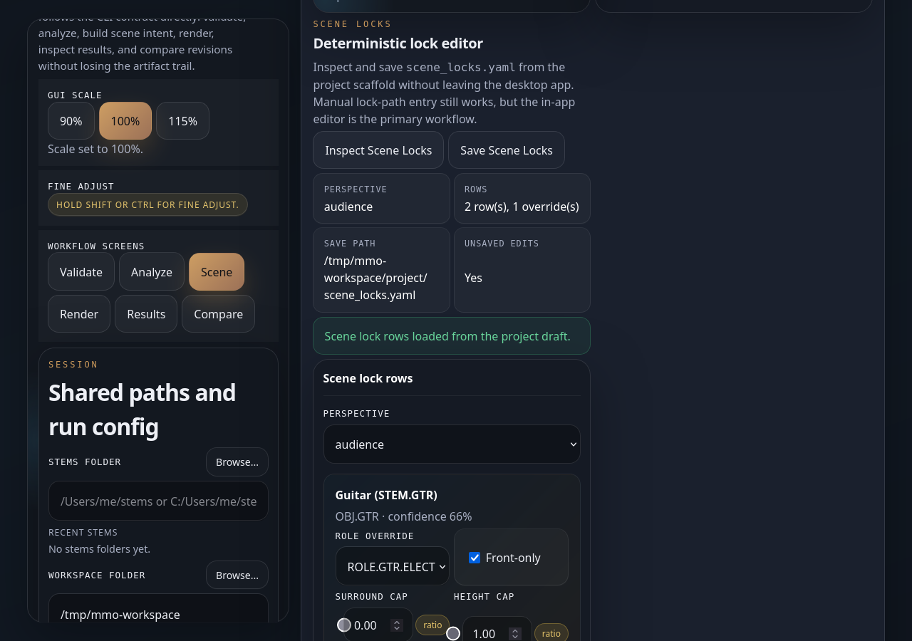

# Desktop GUI walkthrough

The packaged Tauri desktop app is the main end-user path for MMO.

It does not hide the truth. It runs the same artifact-backed workflow as the
CLI and keeps the same receipts and QA files.

## Before you click anything

These four terms matter most:

- `stems folder`: your exported tracks from the DAW
- `workspace`: MMO's session notebook folder
- `scene`: the placement plan, like a stage plot for your mix
- `receipt`: the render packing slip that explains what changed and what was
  blocked

## Launch

End users:

- open the installed MMO desktop app from the packaged release

Contributors:

- local dev commands live in [gui/desktop-tauri/README.md](../../gui/desktop-tauri/README.md)

## Shared session shell

Before running any stage, set the shared session fields:

- `Stems dir`: the folder containing the audio files MMO should inspect
- `Workspace dir`: the folder where MMO will write every artifact
- `Layout standard`: the channel-ordering standard at the I/O boundary
- `Render target`: the version you want to bounce, such as `stereo`, `5.1`, or
  `7.1.4`

Use the built-in `Browse...` buttons if you do not want to type paths by hand.

The same session shell stays with you as you move through:

`Validate -> Analyze -> Scene -> Render -> Results -> Compare`

## Validate

Validate is the soundcheck for your folder setup.

What it does:

- creates or refreshes the project scaffold inside the workspace
- checks that MMO can read the stems and write project artifacts
- writes `project/validation.json`

What to look for:

- the right stems folder
- the right workspace
- a clean validation result before you move on

## Analyze

Analyze is where MMO "listens" to the stems and writes its session notes.

What it writes:

- `report.json`
- `report.scan.json`

Think of `report.json` as the main notebook page and `report.scan.json` as the
raw field notes behind it.

If Analyze fails, the most common causes are:

- the stems path is wrong
- the folder has no readable audio files
- `ffmpeg` or `ffprobe` are missing

## Scene

Scene turns the analyzed session into a placement draft.

What it writes:

- `stems_map.json`
- `bus_plan.json`
- `bus_plan.summary.csv`
- `scene.json`
- `scene_lint.json`

Think of this stage as MMO taking your stems and drawing a stage plot:

- what belongs together
- where it should live
- what needs a warning before render

`scene_lint.json` is the safety check on that stage plot. If it flags something,
read it before rendering.

### Scene locks

Scene Locks are optional manual overrides.

Use them when you want to tell MMO:

- "keep this part more front-heavy"
- "limit how much of this goes to surrounds"
- "cap how much goes overhead"
- "treat this stem as a different role"

MMO saves those edits as `scene_locks.yaml`.

## Render

Render is the bounce stage.

What it uses:

- `report.json`
- `scene.json`
- optional `scene_locks.yaml`

What it writes:

- `render/` audio outputs
- `render_manifest.json`
- `safe_render_receipt.json`
- `render_qa.json`

The most important files here are:

- `render_manifest.json`: the file list
- `safe_render_receipt.json`: what MMO changed, blocked, or skipped
- `render_qa.json`: the post-render quality check

If Render says it was blocked, that means MMO stopped on purpose before writing
audio because a safety gate did not like what it saw. Read the receipt first.

If Render says it wrote zero outputs, MMO still wrote the paperwork. Open the
receipt and QA report to see why no bounce was produced.

## Results

Results is the review desk.

Use it to answer three fast questions:

1. What files did MMO write?
2. What changed?
3. What should I inspect next?

The quick actions on this screen open the most important artifacts:

- `Receipt`
- `Manifest`
- `QA`

That is the fastest way to understand where your outputs went.

## Compare

Compare lets you A/B two finished runs.

Each side can point at:

- a workspace folder
- a `report.json` file inside a workspace

What Compare writes:

- `compare_report.json`
- optional `compare_report.pdf` when you export a PDF

If both workspaces also contain `render_qa.json`, MMO can disclose the
evaluation-only loudness compensation it used for a fair listen.

Think of this screen as two printed mix notes on one desk: MMO lines them up so
you can hear and read the differences more fairly.

## Recommended order

Run the workflow in this order:

`Validate -> Analyze -> Scene -> Render -> Results -> Compare`

You can jump around, but later screens make the most sense after the earlier
artifacts already exist.

## Screenshot policy

The screenshot baseline policy and refresh workflow live in
[assets/screenshots/README.md](assets/screenshots/README.md).
